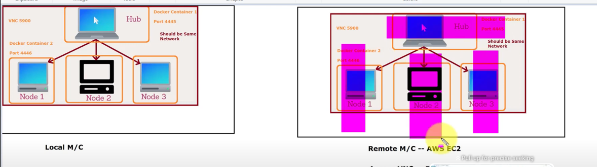

# Selenium-PageObjectModel

# To Run Tests in Local 

Pre-Requisites : 

* Create a folder drivers in project folder and download chromedriver and geckodriver in the folder . 

* Set Remote = false and Docker = false in config.properties .

# To Run Tests in Local Docker

* Make sure docker is started and running
* From the project root folder , run docker-compose up --build
* Selenium Hub , chromedriver and firefox drivers are running fine in docker using docker ps command
* set remote = false and docker = true in config.properties .

# To Run Tests in AWS EC2 Docker

* Set up EC 2 instances in AWS cloud using steps below.
* set remote = true and docker = true in config.properties .

# Setting up EC2 instances and setting up Java , Docker and docker-compose  environment in AWS EC2 

* Login to AWS console and create EC2 instance 
* Launch instance with required memory
* store the .pem file in local 
* ssh -i MyAwskey.pem ec2-user@3.144.82.125
* sudo su
* sudo yum update
* java -version --> Throws error
* mkdir Java
* cd Java
* cd java/
* wget --no-check-certificate -c --header "Cookie: oraclelicense=accept-securebackup-cookie" https://download.oracle.com/java/17/archive/jdk-17.0.1_linux-x64_bin.rpm
* sudo rpm -i jdk-17.0.1_linux-x64_bin.rpm
* java -version
* sudo yum install docker 
* sudo curl -L https://github.com/docker/compose/releases/latest/download/docker-compose-$(uname -s)-$(uname -m) -o /usr/local/bin/docker-compose
* sudo chmod +x /usr/local/bin/docker-compose
* sudo mv /usr/local/bin/docker-compose /usr/bin/docker-compose
* docker-compose -v
* Create docker network using command --> Sudo service docker start
* docker network create grid4nw
* >> docker run -d -p 4445:4444 --net grid4nw --name seleniumHub selenium/hub:4.15.0-20231129
* >> docker run -d -p 4446:5900 -p 4447:7900 --net grid4nw -e SE_EVENT_BUS_HOST=seleniumHub -e SE_EVENT_BUS_PUBLISH_PORT=4442 -e SE_EVENT_BUS_SUBSCRIBE_PORT=4443 --shm-size="2g" --name chromeNode1 selenium/node-chrome:4.15.0-20231129
* >> docker run -d -p 4448:7900 -p 4449:5900 --net frid4nw -e SE_EVENT_BUS_HOST=seleniumHub -e SE_EVENT_BUS_PUBLISH_PORT=4442 -e SE_EVENT_BUS_SUBSCRIBE_PORT=4443 --shm-size="2g" --name firefoxNode1 selenium/node-firefox:4.15.0-20231129

